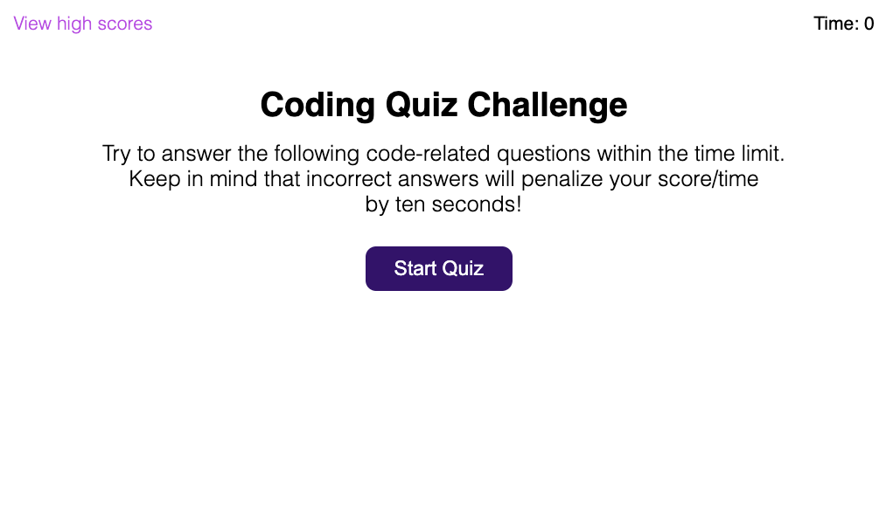
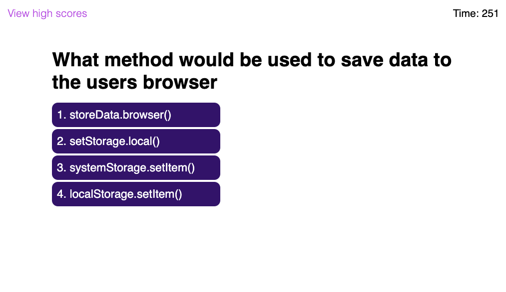
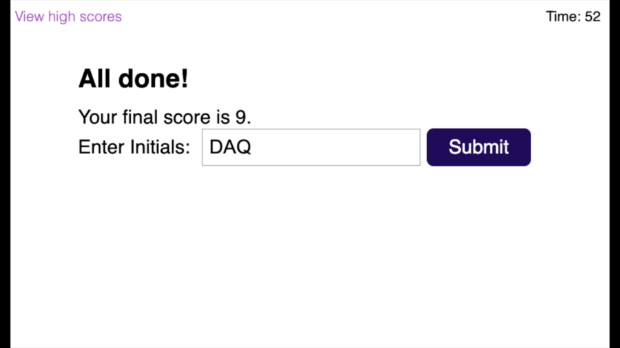

# JavaScript Quiz on JavaScript
`js-quiz` a timed quiz on JavaScript fundamentals. Functions in browser, this quiz will keep the top 5 scores on a persistent leader board in localStorage. 

The current array of questions are all JavaScript related, but could easily be altered to test on any subject matter.

## Programming Objectives
* Dynamically alter HTML with JavaScript to prevent loading new html pages.
* Create an array of multiple-choice question objects. containing question, potential answers, and correct answer.
* Randomize the questions array on quiz start to add some unpredictability to retake value.
* Use event listeners to trigger function calls based on what a user clicks.
* Using event.target.matches() to determine element clicked.
* Use setTimeout in a recursive function that decrements a variable every second to create a countdown timer.
* Create an array of the top 5 high scores to record in and retrieve from, localStorage.
* Create a responsive design that is as true to the Mock-up as I can get.

## Usage
`js-quiz` is a 30 question length, multiple choice, timed examination of one's basic JavaScript knowledge. The entirety of the app can be navigated with the click of a mouse or a tap of a button with minimal scrolling at worst. 10 seconds is given for each question in the quiz for a total of 300 seconds, and 10 second shall be deducted for every wrong answer.

Once [the page](https://qcent.github.io/js-quiz-app/) loads you will be greeted with the above screen where you may view current high scores or start the quiz.

When the quiz begins you will be presented with up to 30 multiple choice questions. Simply click or tap on the answer that satisfies you best, to submit it as your choice. You will instantly be taken to the next question and a flash of either *'Correct!'* or *'Wrong!'* will appear at the bottom of the screen to let you know how you did.

The quiz will end once tester has exhausted all questions or the timer has reached 0. Then an input for your initials (up to 4 characters) is shown and you can submit your name and score to the leaderboard. The top 5 best scores are saved for posterity in the browsers localStorage. But can be wiped away with the click of a button or two.

## Contributing

Contributions to `js-quiz` are welcomed! 

## License
`js-quiz` is Copyright 2021 Dave Quinn - Quinnco Enterprises.

`js-quiz` is licensed under the [MIT License](https://opensource.org/licenses/MIT).

Copyright 2021 Dave Quinn

Permission is hereby granted, free of charge, to any person obtaining a copy of this software and associated documentation files (the "Software"), to deal in the Software without restriction, including without limitation the rights to use, copy, modify, merge, publish, distribute, sublicense, and/or sell copies of the Software, and to permit persons to whom the Software is furnished to do so, subject to the following conditions:

The above copyright notice and this permission notice shall be included in all copies or substantial portions of the Software.

THE SOFTWARE IS PROVIDED "AS IS", WITHOUT WARRANTY OF ANY KIND, EXPRESS OR IMPLIED, INCLUDING BUT NOT LIMITED TO THE WARRANTIES OF MERCHANTABILITY, FITNESS FOR A PARTICULAR PURPOSE AND NONINFRINGEMENT. IN NO EVENT SHALL THE AUTHORS OR COPYRIGHT HOLDERS BE LIABLE FOR ANY CLAIM, DAMAGES OR OTHER LIABILITY, WHETHER IN AN ACTION OF CONTRACT, TORT OR OTHERWISE, ARISING FROM, OUT OF OR IN CONNECTION WITH THE SOFTWARE OR THE USE OR OTHER DEALINGS IN THE SOFTWARE.
